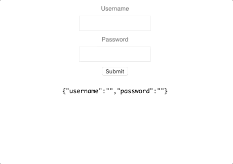

# react-dirty-form

> A form input component library

[](https://www.npmjs.com/package/react-dirty-form) [](https://standardjs.com)

## Install

```bash
npm install --save react-dirty-form
```

## Demonstration



## Usage

```tsx
import React, { useEffect } from 'react'
import { useForm, TextInput } from 'react-dirty-form';

const App = () => {

  const { form, setForm, isDirty, handleInputChange, handleSubmit } = useForm(postFormToServer);

  useEffect(() => {
    setForm({ username: 'user1', password: 'password1' });
  }, []);

  function customPasswordValidation(value: string): boolean {
    return !(value.toLowerCase() === value || value.toUpperCase() === value);
  }

  function postFormToServer() {
    console.log("Sending form: ", form);
  }

  return (
    <div style={{ display: 'flex', flexDirection: 'column', alignItems: 'center' }}>
      <TextInput
        name="username"
        isDirty={isDirty}
        value={form.username}
        onChange={handleInputChange}
        minLength={3}
        maxLength={12}
        containerStyle={containerStyle}
        containerErrorStyle={containerErrorStyle}
        labelStyle={labelStyle}
        labelErrorStyle={labelErrorStyle}
        inputStyle={inputStyle}
        inputErrorStyle={inputErrorStyle}
        errorMessageStyle={errorMessageStyle}
        label="Username" />
      <TextInput
        name="password"
        isDirty={isDirty}
        value={form.password}
        onChange={handleInputChange}
        minLength={3}
        containerStyle={containerStyle}
        containerErrorStyle={containerErrorStyle}
        customValidation={{ validator: customPasswordValidation, errorMessage: "Passwords must contain at least one upper and one lower case letter" }}
        labelStyle={labelStyle}
        labelErrorStyle={labelErrorStyle}
        inputStyle={inputStyle}
        inputErrorStyle={inputErrorStyle}
        errorMessageStyle={errorMessageStyle}
        isRequired
        isPassword
        label="Password" />
      <button style={{ marginBlockEnd: '10px' }} onClick={handleSubmit}>Submit</button>
    </div>
  );
}

export default App;

const containerStyle = `
  display: flex;
  user-select: none;
  flex-direction: column;
  align-items: center;
  font-family: 'Helvetica';
  margin-block-end: 10px;
`;

const containerErrorStyle = `
  color: red;
`;

const labelStyle = `
  font-size: 12px;
  color: gray;
  margin-block-end: 7px;
  transition: color 0.15s ease-in-out;
`;

const labelErrorStyle = `
  color: darkred;
`;

const inputStyle = `
  outline: none;
  border: 1px solid #E8E8E8;
  height: 30px;
  font-size: 12px;
  padding: 7px 7px;
  box-sizing: border-box;
  max-width: 150px;
  width: 100%;
  transition: border 0.15s ease-in-out;
  &:hover {
    border-color: lightgray;
  }
  &:focus {
    border-color: lightgray;
  }
`;

const inputErrorStyle = `
  border: 1px solid red;
  &:hover {
    border-color: red;
  }
  &:focus {
    border-color: red;
  }
`;

const errorMessageStyle = `
  margin-block-start: 7px;
  color: red;
  font-size: 12px;

`;
```

## License

MIT © [omerbresinski](https://github.com/omerbresinski)
